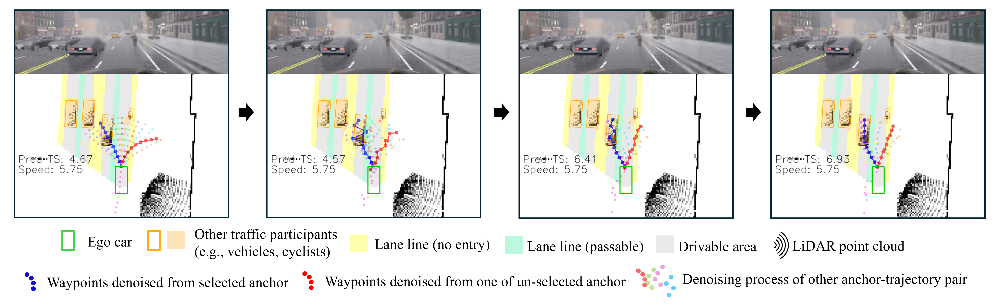
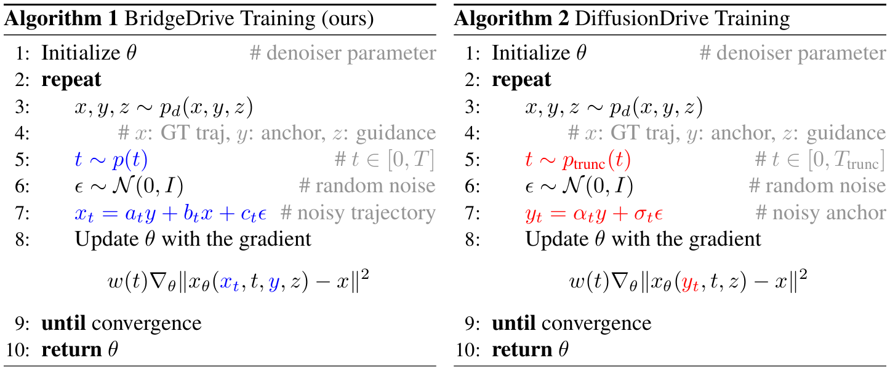

<div align="center">
<!--  -->

[](https://space.bilibili.com/1745143606?spm_id_from=333.788.upinfo.detail.click)

<h1>BridgeDrive</h1>
<h3>Diffusion bridge policy for closed-loop trajectory planning in autonomous driving</h3>

[Shu Liu](https://www.linkedin.com/in/liushu14/)<sup>* :email:</sup>, [Wenlin Chen](https://wenlin-chen.github.io/)<sup>* </sup>, Weihao Li <sup>* </sup>, [Zheng Wang](https://github.com/Wangzzzzzzzz)<sup>* </sup>, [Lijin Yang](https://scholar.google.com/citations?user=ppR-rpkAAAAJ&hl=en), Jianing Huang, Yipin Zhang, [Zhongzhan Huang](https://scholar.google.com/citations?user=R-b68CEAAAAJ&hl=zh-CN), [Ze Cheng](https://scholar.google.com/citations?user=lisP04YAAAAJ&hl=en), Hao Yang

Bosch (China) Investment Co., Ltd. & Bosch Center for Artificial Intelligence

(<sup>*</sup>) equal contribution,
(<sup>:email:</sup>) corresponding author: shu.liu2@cn.bosch.com

Accepted to ICLR 2026!

</div>

## News
* **` Apr. 15th, 2026`:** We release the BridgeDrive's adaptation to DiffusionDrive, enabling training and testing on Navsim datasets. 
* **` Mar. 24th, 2026`:** We release the BridgeDrive [model](https://huggingface.co/liushu-ethz/BridgeDrive). 
* **` Mar. 09th, 2026`:** We release the initial version of code, along with documentation and training/evaluation scripts. 
* **` Jan. 26th, 2026`:** BridgeDrive is accepted to ICLR 2026!
* **` Sep. 28th, 2025`:** We released our paper on [Arxiv](https://arxiv.org/abs/2509.23589). Code/Models are coming soon. Please stay tuned! ☕️


## Table of Contents
- [News](#news)
- [Table of Contents](#table-of-contents)
- [Introduction](#introduction)
- [Method](#method)
- [Quantitative Results on PDM-Lite and LEAD datasets](#quantitative-results-on-pdm-lite-and-lead-datasets)
- [Video Demo](#video-demo)
- [Code](#code)
  - [1. Configuration](#1-configuration)
  - [2. Data Preparation](#2-data-preparation)
    - [2.1 LEAD Datasets](#21-lead-datasets)
    - [2.2 Pretrained Models](#22-pretrained-models)
  - [3. Training](#3-training)
  - [4. Inference](#4-inference)
- [Contact](#contact)
- [Acknowledgement](#acknowledgement)
- [Citation](#citation)

## Introduction
Diffusion-based planners excel in autonomous driving by capturing multi-modal behaviors, but guiding them for safe, closed-loop planning remains challenging. Existing methods rely on anchor trajectories but suffer from a truncated diffusion process that breaks theoretical consistency. We introduce **BridgeDrive**, an anchor-guided diffusion bridge policy that directly transforms coarse anchors into refined plans while preserving consistency between forward and reverse processes. BridgeDrive supports efficient ODE solvers for real-time deployment.  We achieve state-of-the-art performance on the Bench2Drive closed-loop evaluation benchmark, improving the success rate by **7.72%** and **2.45%** over prior arts with PDM-Lite and LEAD datasets, respectively.


## Method
**BridgeDrive**, a principled diffusion framework, leverages Denosing Diffusion Bridge Model (DDBM) to learn a diffusion process that *bridges* the gap from a given coarse anchor trajectory to a refined, context-aware final trajectory plan. 

The denoising process of BridgeDrive ($t = T → 0$  from left to right) is visualized as below.
The leftmost figure denotes anchor $x_{T}$, and the rightmost denotes the planned trajectory $x_{0}$. In each figure, the blue solid line depicts the denoised trajectory of the selected anchor at a specific timestep $t$, the red solid line depicts an example of the denoised trajectory of an un-selected anchor, and the rest scattered dots of other colors depict the denoised trajectories of other anchors at the timestep $t$.
The red trajectory illustrates a failed case when a wrong anchor is selected.

<div align="center">

</div>

This visualization highlights the importance of anchor guidance. In practice, our anchor selection classifier achieves high accuracy, effectively providing proper guidance (i.e., selecting the correct anchor) to generate appropriate trajectories. This enables BridgeDrive to outperform full diffusion models that operate without anchor guidance.

<br>

BridgeDrive is further distinguished by its **theoretical rigor**, as it restores the inherent symmetry of diffusion models—addressing a fundamental flaw in prior truncated approaches.

A conceptual comparison between a standard full diffusion model, DiffusionDrive, and BridgeDrive is illustrated below:

- **Full diffusion model:**  
  `ground truth trajectory → (forward diffusion) Gaussian noise → (reverse denoising) ground truth trajectory`  
  <span style="color:green">✔</span> *Diffusion symmetry preserved!*

- **DiffusionDrive:**  
  `anchor → (forward diffusion) noised anchor → (reverse denoising) ground truth trajectory`  
  <span style="color:red">✗</span> *Diffusion symmetry violated!*  
  *Issue:* The starting point of the forward process (anchor) should match the endpoint of the reverse process (ground truth trajectory), but they are inconsistent.

- **BridgeDrive (Ours):**  
  `ground truth trajectory → (forward diffusion bridge) anchor → (reverse denoising bridge) ground truth trajectory`  
  <span style="color:green">✔</span> *Diffusion symmetry preserved!*

The key algorithmic difference between BridgeDrive and DiffusionDrive is highlighted below.
<div align="center">

</div>


## Quantitative Results on PDM-Lite and LEAD datasets

BridgeDrive, evaluated primarily on the PDM-Lite training dataset, achieves state-of-the-art performance on most metrics in the Bench2Drive benchmark.

Comprehensive comparison between BridgeDrive and baselines. BridgeDrive prioritizes safety over Comfortness.
| Method | Expert | Key technique | DS | SR(%) | Effi. | Comfort. |
|--------|--------|---------------|-----|--------|--------|----------|
| TCP-traj* | Think2Drive | CNN, MLP, GRU | 59.90 | 30.00 | 76.54 | 18.08 |
| UniAD-Base | Think2Drive | Transformer | 45.81 | 16.36 | 129.21 | **43.58** |
| VAD | Think2Drive | Transformer | 42.35 | 15.00 | 157.94 | 46.01 |
| DriveTransformer | Think2Drive | Transformer | 63.46 | 35.01 | 100.64 | 20.78 |
| ORION | Think2Drive | VLA+VAE | 77.74 | 54.62 | 151.48 | 17.38 |
| ORION diffusion | Think2Drive | VLA+Diffusion | 71.97 | 46.54 | N/A | N/A |
| DiffusionDrive $^{\text{temp}}$ | PDM-Lite | Diffusion | 77.68 | 52.72 | 248.18 | 24.56 |
| SimLingo | PDM-Lite | VLA | 85.07 | 67.27 | **259.23** | 33.67 |
| TransFuser++ | PDM-Lite | Transformer | 84.21 | 67.27 | N/A | N/A |
| **<span style="color:lightblue">BridgeDrive</span>** | PDM-Lite | Diffusion | **87.99 (+2.92)** | **74.99 (+7.72)** | 236.49 | 20.98 |

Multi-ability evaluation results on Bench2Drive. BridgeDrive outperforms all baselines in all categories except for Give Way and Overtake.
| Method | Merg. | Overtak. | Emer. Brake | Give Way | Traf. Sign | Mean |
|--------|--------|----------|-------------|----------|------------|------|
| TCP-traj* | 8.89 | 24.29 | 51.67 | 40.00 | 46.28 | 34.22 |
| UniAD-Base | 14.10 | 17.78 | 21.67 | 10.00 | 14.21 | 15.55 |
| VAD | 8.11 | 24.44 | 18.64 | 20.00 | 19.15 | 18.07 |
| DriveTransformer | 17.57 | 35.00 | 48.36 | 40.00 | 52.10 | 38.60 |
| ORION | 25.00 | **71.11** | 78.33 | 30.00 | 69.15 | 54.72 |
| DiffusionDrive $^{\text{temp}}$ | 50.63 | 26.67 | 68.33 | 50.00 | 76.32 | 54.38 |
| SimLingo | 54.01 | 57.04 | 88.33 | **53.33** | 82.45 | 67.03 |
| TransFuser++ | 58.75 | 57.77 | 83.33 | 40.00 | 82.11 | 64.39 |
| **<span style="color:lightblue">BridgeDrive</span>** | **69.92 (+11.17)** | 66.67 (-4.44) | **90.00 (+1.67)** | 50.00 (-3.33) | **89.47 (+7.02)** | **73.15 (+6.12)** |

<br>

LEAD (Nguyen et al., 2026), a recent work, minimizes the generalization gap in end-to-end autonomous driving by introducing a novel expert policy and dataset designed to mitigate Learner-Expert Asymmetry in CARLA. The tables below present a preliminary evaluation of BridgeDrive on this new training dataset (as of 2026-03-07).

| Method | Expert | DS | SR(%) | Effi. | Comfort |
|--------|--------|-----|--------|--------|---------|
| TFv6 (Nguyen et al., 2026) | LEAD | 95.2 ± 0.3 | 86.8 ± 0.7 | N/A | N/A |
| **<span style="color:lightblue">BridgeDrive</span>** | PDM-Lite | 87.99 ± 0.67 | 74.99 ± 1.35 | **236.49** ± 2.32 | 20.98 ± 0.74 |
| **<span style="color:lightblue">BridgeDrive</span>** | LEAD | **96.34** ± 0.55 | **89.25** ± 0.50 | 202.92 ± 3.27 | **23.24** ± 1.06 |

| Method |Expert | Merg. | Overtak. | Emer. Brake | Give Way | Traf. Sign | Mean |
|--------|--------|--------|----------|-------------|----------|------------|------|
| **<span style="color:lightblue">BridgeDrive</span>**| PDM-Lite |69.92 | 66.67 | 90.00 | 50.00 | 89.47 | 73.15 |
| **<span style="color:lightblue">BridgeDrive</span>** | LEAD | 76.25 | 95.56 | 96.67 | 50.00 | 92.63 | 82.22 |

BridgeDrive achieves performance comparable
to LEAD. Notably, its success rate is 0.72% lower than that of LEAD, while its driving score is
0.22 higher. The evaluation indicates that BridgeDrive generalizes well across different training
sets. Further improvements are expected through a more thorough investigation of anchor quantity,
diffusion parameters, learning rate, training duration, and the speed control mechanism.

## Video Demo

<!--https://github.com/user-attachments/assets/0e2fe519-a7e7-482c-a013-fdb4641b9801  figure 3
https://github.com/user-attachments/assets/361bf92e-bd7f-4cf4-aeb6-91963801832c  figure 4
https://github.com/user-attachments/assets/6c0b5182-c820-41b4-9db4-7febfc9a0bf8  figure 5
https://github.com/user-attachments/assets/35f40c6d-dcf5-4e27-8d16-38a1fb604a4a  figure 6
https://github.com/user-attachments/assets/98f612ba-a45f-472b-b4e0-f5054c155dd2  figure 7 -->


Temporal waypoints exhibited deficiencies in overtaking manoeuvre coordination and speed control, which directly led to a collision with the white vehicle. In comparison, geometric waypoints adapted its planning to overtake a sequence of parked cars. 

<div align="center">
  <table>
    <tr>
      <th width="400">Temporal waypoints (Fig. 3)</th>
      <th width="400">Geometric waypoints (Fig. 4)</th>
    </tr>
    <tr>
      <td align="center">
        <video src="https://github.com/user-attachments/assets/0e2fe519-a7e7-482c-a013-fdb4641b9801" controls width="300">
        </video>
      </td>
      <td align="center">
        <video src="https://github.com/user-attachments/assets/361bf92e-bd7f-4cf4-aeb6-91963801832c" controls width="300">
        </video>
      </td>
    </tr>
  </table>
</div>

<br>

Full Diffusion model, without prior guidance from anchor, failed to adhere to the target time window for lane-changing manoeuvres, which consequently led to a collision with the road barrier. BridgeDrive achieved timely lane changing due to anchor guidance and successfully navigated through the road fork.

<div align="center">
  <table>
    <tr>
      <th width="400">Full diffusion model (Fig. 5)</th>
      <th width="400">BridgeDrive (Fig. 6)</th>
    </tr>
    <tr>
      <td>
        <video src="https://github.com/user-attachments/assets/6c0b5182-c820-41b4-9db4-7febfc9a0bf8" controls width="300">
        </video>
      </td>
      <td>
        <video src="https://github.com/user-attachments/assets/35f40c6d-dcf5-4e27-8d16-38a1fb604a4a" controls width="300">
        </video>
      </td>
    </tr>
  </table>
</div>


<br>

BridgeDrive cannot handle imperfect timing of lane-changing, which resulted from cumulative errors. This situation is outside of the training data distribution.


<div align="center">
  <table>
    <tr>
      <th width="400">Limitation of BridgeDrive</th>
    </tr>
    <tr>
      <td align="center">
        <video src="https://github.com/user-attachments/assets/98f612ba-a45f-472b-b4e0-f5054c155dd2" controls width="300">
        </video>
      </td>
    </tr>
  </table>
</div>

## Code 

BridgeDrive is developed mainly based on [Transfuser](https://github.com/autonomousvision/transfuser), [Carla Garage](https://github.com/autonomousvision/carla_garage), [DiffusionDrive](https://github.com/hustvl/DiffusionDrive), and [LEAD](https://github.com/autonomousvision/lead) (in chronological order). We provide an adapted version for LEAD, as BridgeDrive achieves its best performance within LEAD’s framework. When using our code, please remember to star, fork, and acknowledge the above-mentioned projects accordingly.

### BridgeDrive adaptation LEAD
#### 1. Configuration

Clone LEAD repository (`a41d11616d06843ba89388a278e6e025b6a47878`) to path_to_LEAD and follow their configuration steps.

```bash
git clone https://github.com/autonomousvision/lead.git
```

Clone the BridgeDrive repository to path_to_BridgeDrive

```bash
git clone https://github.com/shuliu-ETHZ/BridgeDrive.git
cd BridgeDrive/BridgeDrive_adaptation_LEAD
```

The `BridgeDrive_adaptation_LEAD` folder mirrors the directory structure of LEAD. By transferring files via `utils_file_transfer.py`, you can integrate BridgeDrive into an existing LEAD repository in a **plug-and-play** manner:

```bash
# update source_folder and destination_folder in utils_file_transfer.py
python utils_file_transfer.py
```
#### 2. Data Preparation
Before running BridgeDrive, ensure the following data and pretrained models are placed in the correct paths of your LEAD repository:

##### 2.1 LEAD Datasets
Download the official LEAD datasets and store them in:
```bash
# Replace `path_to_LEAD` with the actual path of your LEAD repository
path_to_LEAD/data/carla_leaderboard2/data
```

##### 2.2 Pretrained Models
Download the pretrained models by following the official instructions from the LEAD project, then place them in:
```bash
# Replace `path_to_LEAD` with the actual path of your LEAD repository
path_to_LEAD/data/lead_ckpt/tfv6
```

#### 3. Training
```bash
cd path_to_LEAD # with files from BridgeDrive
./scripts/posttrain_bridgedrive.sh
```

#### 4. Inference
```bash
cd path_to_LEAD
./scripts/eval_bench2drive_bridgedrive.sh
```

### BridgeDrive adaptation DiffusionDrive


#### 1. Configuration

Clone DiffusionDrive repository and follow their configuration steps.

```bash
git clone https://github.com/hustvl/DiffusionDrive.git
```

Clone the BridgeDrive repository to path_to_BridgeDrive

```bash
git clone https://github.com/shuliu-ETHZ/BridgeDrive.git
cd BridgeDrive/BridgeDrive_adaptation_DiffusionDrive
```

The `BridgeDrive_adaptation_DiffusionDrive` folder mirrors the directory structure of DiffusionDrive. By copying the content in `BridgeDrive_adaptation_DiffusionDrive` folder to `DiffusionDrive` folder, you can integrate BridgeDrive into an existing DiffusionDrive repository in a **plug-and-play** manner:

#### 2. Data Preparation
Before running BridgeDrive, ensure the following data and pretrained models are placed in the correct paths of your DiffusionDrive repository:

##### 2.1 Navsim Datasets
Download the official Navsim datasets as instructed in Diffusiondrive.

##### 2.2 Pretrained Models
Download the pretrained models instructed in Diffusiondrive.

#### 3. Training
```bash
cd path_to_DiffusionDrive # with files from BridgeDrive
./run_train_BridgeDrive_k80_beta10.sh
```

#### 4. Inference
```bash
cd path_to_DiffusionDrive
./run_main_testing_BridgeDrive_k80_beta10
```


## Contact
If you have any questions, please contact [Shu Liu](https://www.linkedin.com/in/liushu14/) via email (shu.liu2@cn.bosch.com).

## Acknowledgement
BridgeDrive is built upon the excellent work of the following open-source projects (in chronological order):
- [Transfuser](https://github.com/autonomousvision/transfuser) (MIT License)
- [Carla Garage](https://github.com/autonomousvision/carla_garage) (MIT License)
- [DiffusionDrive](https://github.com/hustvl/DiffusionDrive) (MIT License)
- [LEAD](https://github.com/autonomousvision/lead) (MIT License)

We provide an adapted implementation for LEAD, as BridgeDrive achieves its best performance within LEAD's framework. When using this project, please comply with the license terms of the above projects and acknowledge them appropriately.

BridgeDrive is also greatly inspired by the following outstanding contributions to the open-source community: [NAVSIM](https://github.com/autonomousvision/navsim), [VAD](https://github.com/hustvl/VAD), [Bench2Drive Leaderboard](https://github.com/autonomousvision/Bench2Drive-Leaderboard), [Bench2Drive](https://github.com/Thinklab-SJTU/Bench2Drive/), [PDM-Lite](https://github.com/OpenDriveLab/DriveLM/blob/DriveLM-CARLA/pdm_lite/docs/report.pdf), [leaderboard](https://github.com/carla-simulator/leaderboard), [scenario_runner](https://github.com/carla-simulator/scenario_runner)

Please cite these works for the respective components of the repo.

## Citation
If you find BridgeDrive is useful in your research or applications, please consider giving us a star 🌟 and citing it by the following BibTeX entry.


```bibtex
@inproceedings{
liu2026bridgedrive,
title={BridgeDrive: Diffusion Bridge Policy for Closed-Loop Trajectory Planning in Autonomous Driving},
author={Shu Liu and Wenlin Chen and Weihao Li and Zheng Wang and Lijin Yang and Jianing Huang and Yipin Zhang and Zhongzhan Huang and Ze Cheng and Hao Yang},
booktitle={The Fourteenth International Conference on Learning Representations},
year={2026},
url={https://arxiv.org/abs/2509.23589}
}
```

